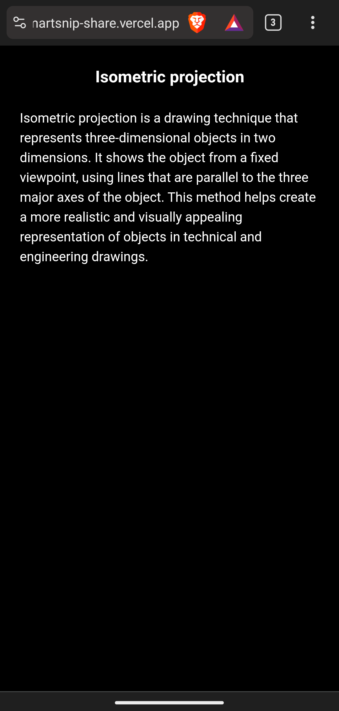

# SmartSnip


SmartSnip is a mobile application that leverages the power of React Native, Firebase, and GPT4Free to simplify the note-taking process. Instead of manually typing and saving notes, users can create subjects and topics within those subjects. SmartSnip utilizes AI to generate summarized and simplified notes on specific topics, providing users with a more efficient way to capture information.
## Screenshots

|  Welcome Screen                   |  **Home Screen**         |
| ------------------------------------------------------------------- | -------------------------------------------------------------- |
|  **Subject Screen**   |  **Create a new note screen** |
|  **Note View Screen** |  **Public share view**  |


## Tech Stack

- React Native: A framework for building native mobile applications using React.
- Firebase: A comprehensive mobile and web application development platform, including authentication, real-time database, and cloud storage.
- [GPT4Free](https://github.com/xtekky/gpt4free): An unofficial free API for OpenAI's API, providing powerful natural language processing capabilities.
- Flask: For creating backend api server using g4f package. See demo server at [g4f-server](https://github.com/vivekkj123/g4f-server)
- Nextjs: For displaying public shared notes. see [SmartSnip-share](https://github.com/vivekkj123/SmartSnip-share)


## Features

- **Subject Management:** Create and organize subjects to categorize your notes effectively.

- **Topic Summarization:** Enter specific topics within subjects, and let the AI-powered GPT-4-Free generate summarized notes for you.

- **Firebase Authentication:** Securely authenticate users and ensure private access to their subjects and notes.

- **Share notes with your classmates:** Once a note is created you can share it with your classmates using a public viewable link

## Getting Started

1. Clone the repository:

   ```bash
   git clone https://github.com/your-username/SmartSnip.git
   ```

2. Install dependencies:

   ```bash
   cd SmartSnip
   npm install
   ```

3. Set up Firebase:

   - Create a Firebase project at [Firebase Console](https://console.firebase.google.com/).
   - Obtain the `google-services.json` from firebase and replace them in `android/app/` directory

4. Run the application:

   ```bash
   npm start
   ```

## Contributing

This project is created as part of our semester 5 project exhibition. If you are inspired and too enthusiastic about this web application, feel free to ping me on any social medias before proposing any changes.

## License

This project is licensed under the [MIT License](LICENSE).
